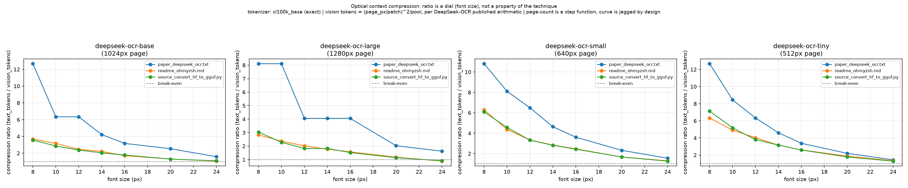

# Optical Context Compression — POC (Tier 1)

Measures the token-cost tradeoff of rendering text into an image and feeding
it to a vision encoder instead of tokenizing it as text, using DeepSeek-OCR's
published resolution-mode arithmetic (patch=16, 16x conv compressor).

**This is Tier 1 only: cost, not accuracy.** It says nothing about whether
the text can be read back — that's Tier 2 (not built yet, needs a GPU + the
DeepSeek-OCR model itself). See `plan.md` for the full milestone plan.

## What "compression" means here

Fewer tokens in the sequence the LLM's decoder attends over. **Not**
information-theoretic compression — never compare this to gzip. Vision
tokens are not free: a full encoder forward pass sits behind each one. The
thing this saves is decoder sequence length, which is what hurts as context
grows.

## Method

- Text tokens: `tiktoken` `cl100k_base`, exact (not approximated).
- Text rendered to square page images with a monospace font (DejaVu Sans
  Mono), paginated to fit each profile's fixed canvas.
- Vision tokens: `(page_px / patch)^2 / pool`, per page, times page count —
  DeepSeek-OCR's own published Tiny/Small/Base/Large resolution modes
  (arXiv:2510.18234).
- Documents: 3 real files, all 10k+ chars (short docs make the ratio flat —
  fixed page overhead dominates):
  - `data/paper_deepseek_ocr.txt` — prose, excerpted from the DeepSeek-OCR
    paper itself (Intro + Methodology sections, tables/figures stripped).
  - `data/readme_ohmyzsh.md` — a real long README.
  - `data/source_convert_hf_to_gguf.py` — real source code, meaningful
    indentation.

## Results

Full sweep: `results/tier1_sweep.csv` (font sizes 8–24px × 4 encoder
profiles × 3 documents, 84 rows).



`deepseek-ocr-base` profile (1024px page), compression ratio = text_tokens /
vision_tokens:

| font (px) | paper (prose) | README | source code |
|---:|---:|---:|---:|
| 8  | 12.68x | 3.69x | 3.57x |
| 12 | 6.34x  | 2.46x | 2.38x |
| 16 | 3.17x  | 1.70x | 1.78x |
| 20 | 2.54x  | 1.30x | 1.30x |
| 24 | 1.58x  | 1.06x | 1.10x |

Ratio falls monotonically as font size grows — because bigger glyphs mean
fewer characters fit per fixed-size page, which means more pages, which
means more vision tokens. **The ratio is a dial the operator sets by
choosing font size, not a fixed property of "optical compression" as a
technique.** At 24px, the README and source-code docs are close to
break-even (ratio ≈ 1) — rendering to an image barely beats plain text, and
at large-page/large-font settings some rows in the full CSV actually cross
*below* 1 (a net loss).

Page count is a step function (text reflows discretely into a new page),
so the curve is visibly jagged. That's real, not a plotting bug.

## Sanity check: how small is too small?

Rendered a page at 8px (`figures/sanity_8px/`) to check whether the
smallest-font, highest-ratio numbers above are backed by legible text. At
1024px canvas / 8px DejaVu Sans Mono (202 cols × 106 rows), the README page
is still readable on screen — not the unreadable smudge the plan expected.
That's a real result worth noting, not a hedge: legibility-by-eye and
OCR-decodability-by-model are different questions, and only Tier 2 answers
the second one.

## Reproduce

```
python3 -m venv .venv  # or: uv venv .venv
.venv/bin/pip install -r requirements.txt   # or: uv pip install -p .venv/bin/python -r requirements.txt
cd src
../.venv/bin/python tier1_tokens.py \
  --docs ../data/paper_deepseek_ocr.txt ../data/readme_ohmyzsh.md ../data/source_convert_hf_to_gguf.py \
  --profile all --sanity-8px
```

## Status vs. plan.md

- [x] Milestone 1 (Tier 1: token accounting) — done, this repo.
- [ ] Milestone 2 (Tier 2: round-trip CER/WER via DeepSeek-OCR) — not
      started, needs GPU.
- [ ] Milestone 3 (Tier 3: adversarial corpus, find the cliff) — not started.

Until Tier 2 exists: **no claim here about OCR/decoding accuracy.** The
DeepSeek-OCR paper's own reported precision numbers (97% at <10x, ~60% at
20x) are the authors' results, not reproduced here.
